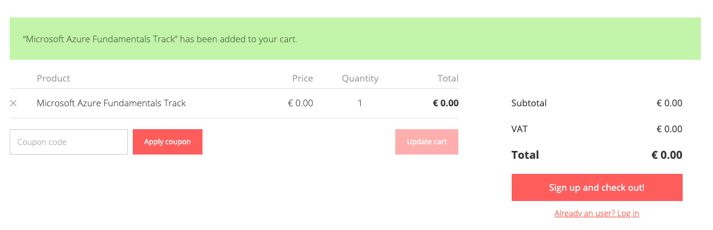
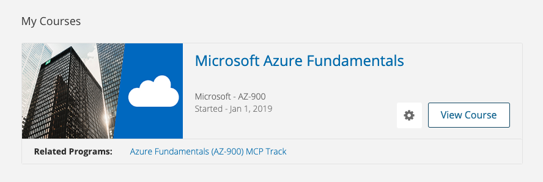
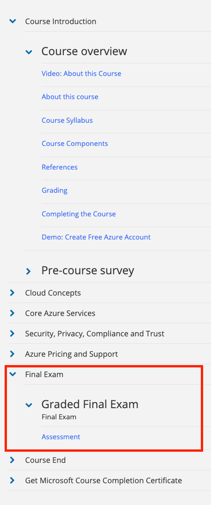

# Enrolling yourself to Future-Proof

>The Future-Proof.net portal is designed for Microsoft partner companies to develop their skills, get support from training companies and test their knowledge through practise tests.

1. Navigate to https://future-proof.net/
1. Scroll down to Microsoft Azure Fundamentals (AZ-900)
1. Click "[Enroll in this track](https://future-proof.net/microsoft-azure-fundamentals/enroll/)"

## Option to select paid additional services

You'll now be presented with additional options for support, buying a certificate of completion and getting yourself an AZ-900 exam voucher.

**Do not select any additional services!**

These options are offered, as the portal is originally designed for partner companies and those additional services might be relevant for them. In our case, we will just enroll to the free course.

**Click add to cart**

## Start the signup process

Ensure that in your cart you see the total of 0€ and continue to "Sign up and check out".

Fill out the form to create an account on Future-Proof.
> In the Company field you can write The Shortcut.

Now the portal will log you in with your new account and present you with the cart view again. Press "Proceed to checkout".

## Confirm your order

Next you'll be presented with the order view. It's asking you to write your company information, as this is a portal designed primarily for partner companies. Use The Shortcut adress and a 00000 for the VAT ID.

Read the terms and conditions of the service, its quite short. Once you've ensured that the chckout total is 0€, accept the terms and place your order.

Once that is completed you'll see a summary view and can select "Start my courses".

## Start the Microsoft Azure Fundamentals Course

Now on your [Dashboard](https://training.future-proof.net/dashboard) you can start the Microsoft Azure Fundamentals course. You might want to bookmark the Dashboard page, so you can easily access it later on.

## Course view

You'll notice that this course contains the same topics that we've covered in our sessions previously. We enrolled to the same course from Future-Proof, just so you get access to the Final Exam, to test your knowledge and find any possible gaps you might have.

Go to the Final Exam -> Graded Final Exam and click on the "Assesment" link to start your exam. 

>**NOTE:** This is not the official exam or the official paid practise exam, but a exam that our learning partner has designed to help you evaluate your skills.

Complete this exam. Based on the results you get, go back to the course contents that we've gone through in this course and brush up on your skills.

Once you feel ready to complete the certification, reach out to the Shortcut team for next steps.